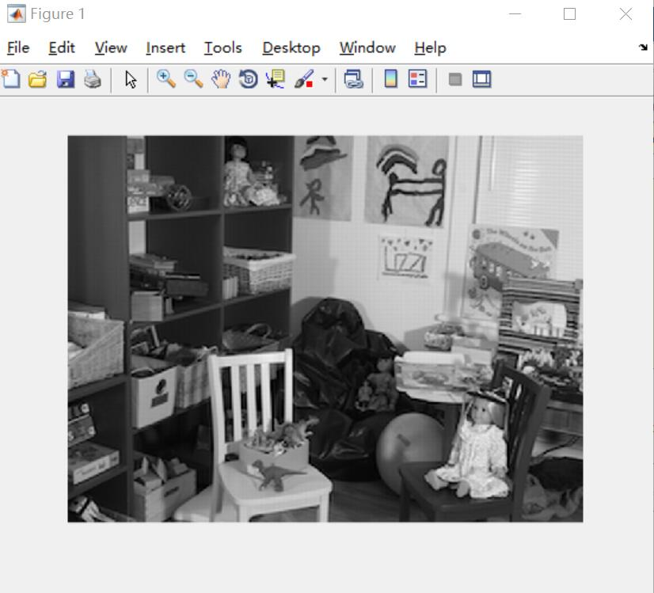
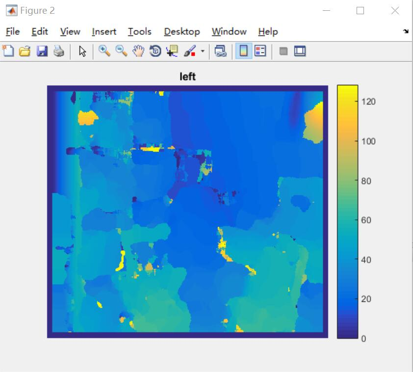
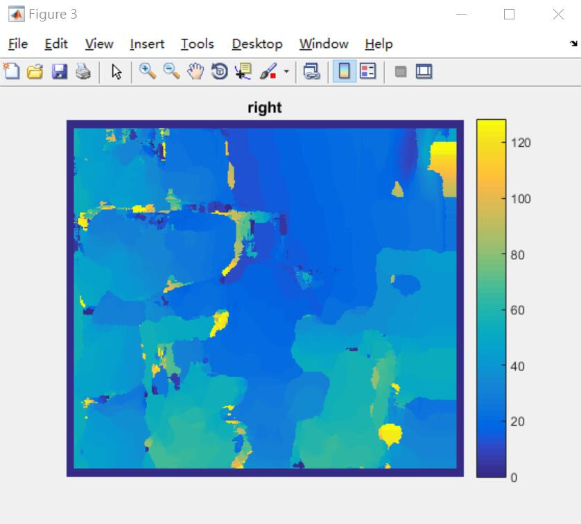
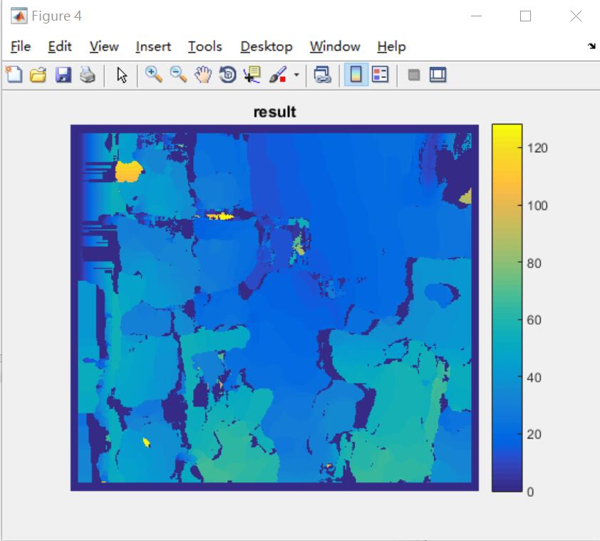

# StereoBM
===
An implementation of the classic stereo vision Block Matching(BM) algorithm.

===
This code implements a classic stereo BM algorithm.
This is not a very fast implementation. But it is simple enough.

#### [中国镜像](https://gitee.com/redpower/StereoBM) ####

[]
[]
[]
[]

#### System Requirements ####

The reference code is tested on <b>windows 10, Ubuntu 18.04</b> and requires:
- Matlab

#### Run ####

```Matlab
>> run main.m

```

#### Known issues ####

None

#### License ####
BSD 2-Clause License. See LICENSE.txt for further details.

